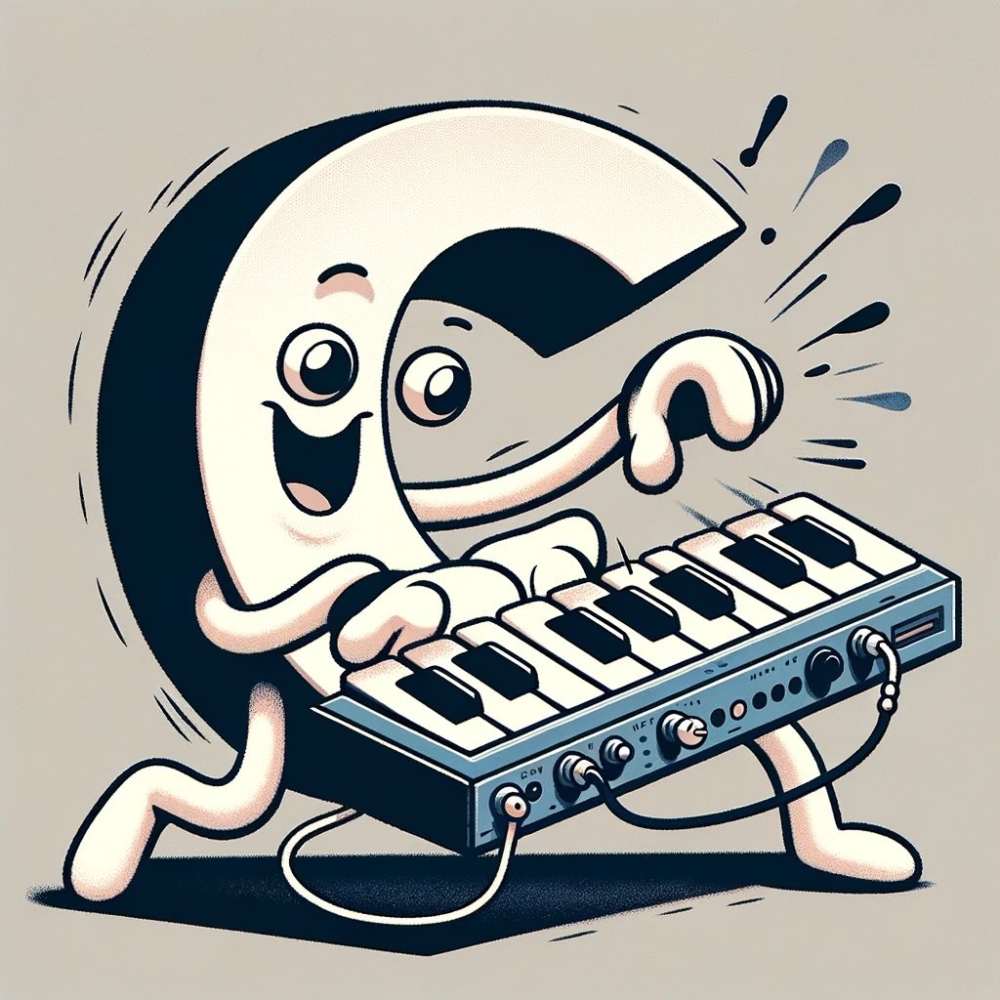

# CSynth

_A simple synth in C._

## Usage

To get started, check out the [examples](examples) folder. Each C file is
executable, e.g. to run `beep.c`, simply run:

```shell
./examples/demo/beep.c
```

This requires GCC (or clang) and [PortAudio](https://www.portaudio.com/)
binaries to be installed. You can also use CSynth without PortAudio; just
replace `play(..)` with `write(..)` to write to a WAV file.

## Tutorial

To make music in CSynth, combine basic (mathematical) functions to create
sounds, instruments, and compositions.

Let's create a single note with reverb. Start by writing a minimal C program
that plays a 440 Hz sine wave:

```c
#include "./src/func/all.h"
#include "./src/io/player.h"

int main()
{
    return play(sine(A4));
}
```

Now run with (and stop by pressing Esc):

```shell
./examples/tutorial.c
```

Taking a closer look, there are three pieces here: the `A4` constant represents
440 Hz, `sine` generates a sine wave at that frequency, and `play` samples the
sine function to your speakers.

To turn the continuous tone into a 0.3 second note, add a rectangular envelope:

```c
    func tone = sine(A4);
    func note = rect_(0, .3, tone);
    play(note);
```

This adds `rect`, which multiplies `tone` by 1 during the interval [0, 0.3] and
0 elsewhere, resulting in a 0.3 second A4 note. We also use `func`, which
indicates a function variable `tone`, allowing us split things across two lines.

Notice the underscore `_`. By default, all functions take other functions as
arguments. By appending `_` to the name, you can pass in a number instead.

Next, place the note in a 1.5 second loop:

```c
    func tone = sine(A4);
    func note = rect_(0, .3, tone);
    func looped = loop_(1.5, note);
    play(looped);
```

Finally, add reverb (interval 0.4s, decay 0.2):

```c
    func tone = sine(A4);
    func note = rect_(0, .3, tone);
    func looped = loop_(1.5, note);
    func revved = reverb_(.4, .2, looped);
    play(revved);
```

Or, to make it more compact:

```c
    play(reverb_(.4,.2,loop_(1.5,rect_(0,.3,sine(A4)))));
```

To listen to the result:
[tutorial.mp3](https://github.com/leovandriel/csynth/raw/main/examples/tutorial.mp3)

To see more of what you can do with CSynth, take a look in
[examples/demo](examples/demo).

To learn more about available functions, take a look in [src/func](src/func) and
[examples/func](examples/func).

## Functions

Functions are the building blocks of CSynth. They can be combined freely,
including nesting of function in unconventional ways. The tutorial started with
`play(sine(A4))`, but you can also:

```c
    play(sine(mul(A4, sine_(1))));
```

Or even:

```c
    play(sine(mul(A4, sine(sine(sine_(1))))));
```

Here, there is no distinction between audio and control (AR vs KR). There are a
few helper functions, like [ar and kr](src/func/op/ops.h) that scale the input
to respective domains:

```c
    play(sine(kr_scale(A4, sine_(1))));
```

The [sine](src/func/gen/sine.h) function has the `_` suffix to allow the
argument to be a number instead of a function. Some function take multiple
arguments in which case you may want to mix functions and numbers. This is done
by wrapping the number in `_(..)`, turning it into a function with that value
(see [const](src/func/gen/const.h)). This is most often the case with functions
like [mul](src/func/op/mul.h), which can take any number of function arguments:

```c
    play(mul(sine(A4), sine_(1), _(.5)));
```

In many cases, it is helpful to check the implementation to see the available
variations of a function, including helpful short-hands. Examples for
[mul](src/func/op/mul.h):

```c
    mul_(.5, sine(A4))
    mul(_(.5), sine(A4))
    mul(_(.5), sine(A4), sine(B4))
    mul_create(3, (func[]){_(.5), sine(A4), sine(B4)})
```

The latter opens the door to programmatic building of sound. For example, to
synthesize the sound of a G chord on the guitar using
[add_create](src/func/op/add.h):

```c
    func chord[] = {G2, B2, D3, G3, B3, G4};
    func notes[6];
    for (int i = 0; i < 6; i++)
    {
        notes[i] = delay_(.1 * i, karplus_strong_(chord[i], .5));
    }
    func strum = add_create(6, notes);
    play(strum);
```

This uses the [Karplus–Strong](src/func/gen/karplus_strong.h) method for string
synthesis. To create specific sounds like that of strings, it is often necessary
to go beyond combining existing functions. The easiest way to do this is to use
[wrap](src/func/util/wrap.h), which takes a C function as input:

```c
double phone_filter(double input, void *context)
{
    return round(input * 10) / 10;
}

int main()
{
    return play(wrap(phone_filter, sine(A4), NULL));
}
```

This approach has its limits, and in most cases the best approach is to
implement a function using [func_create](src/core/func.h). For example, the
above can also be implemented as:

```c
double phone_filter(int count, Gen **args, Eval eval, void *context)
{
    double input = gen_eval(args[0], eval);
    return round(input * 10) / 10;
}

int main()
{
    func tone = sine(A4);
    func phone = func_create(NULL, phone_filter, NULL, 0, NULL, FuncFlagNone, FUNCS(tone));
    return play(phone);
}
```

While this looks more convoluted, it does come with the full range of available
arguments and configuration. These are all explained in detail in
[func.h](src/core/func.h).

Another way to learn more about `func_create` is to look at the implementation
of basic functions like [saw](src/func/gen/saw.h) and
[lpf](src/func/filter/lpf.h). Some of the notation is slightly different from
the examples, e.g. sources use `Func *` instead of `func` and `const_()` instead
of `_()`. This is because the examples use short-hand helpers, while the source
avoids those. Other than that, there is no specific distinction and example code
can easily make its way into the function library.

## UI

While running `play`, function parameters can be controlled with the keyboard
and displayed in the terminal. This is based on an [event](src/event/event.h)
system that broadcasts keyboard input and state changes.

Keyboard input is read by [terminal](src/ui/terminal.h) and broadcasted to
gating functions. The most basic example of this is
[mute](src/func/keyboard/mute.h), which multiplies input by 1 and 0 alternating
at every space bar press.

```c
    play(mute(' ', sine(A4)));
```

To emulate a key on a keyboard or drum pad, use the
[trigger](src/func/keyboard/trigger.h) function, which resets to initial state
on every key press:

```c
    play(trigger(' ', decay_(.5, sine(A4))));
```

There is also [stepper](src/func/keyboard/stepper.h) to control with the up/down
keys and [selector](src/func/keyboard/selector.h) to switch between functions:

```c
    play(selector(' ', sine(A3), sine(A4), sine(A5)));
```

These controls can be combined to create a
[keyboard](src/func/keyboard/keyboard.h):

```c
    play(keyboard(trigger, decay_(.5, sine(C4))));
```

Keyboard strokes can also be recorded and replayed with
[track](src/func/keyboard/track.h) and [replay](src/func/keyboard/replay.h). Key
events are managed by [keyboard_event](src/event/keyboard_event.h). To exit, the
`Esc` key is directly handled by `play`.

To visualize the state of controls, basic [display](src/ui/display.h)
functionality is included for switches and numerical values.

```c
    display_keyboard(' ', "select frequency");
    return play(selector(' ', sine(A3), sine(A4), sine(A5)));
```

## I/O

Most of the examples above use [player](src/io/player.h) to sample a function to
the system audio buffer. A [player](src/io/player.h) takes care of setting up
[PortAudio](https://www.portaudio.com/), the [sampler](src/io/sampler.h), the
[terminal](src/ui/terminal.h), and it cleans things up before exiting the
program. It comes in a few variants:

```c
    play(sine(A4));
    play_duration(10, sine(A4)); // 10 seconds
    play_stereo(sine(A4), sine(B4));
    play_stereo_duration(10, sine(A4), sine(B4));
    play_channels(4, (func[]){sine(A4), sine(B4), sine(C4), sine(D4)});
```

Instead of playing the audio, we can also write things to a wav file using
[write](src/io/writer.h):

```c
    write(10, "output/sine.wav", sine(A4));
    write_(10, sine(A4)); // writes to output/default.wav
    write_stereo(10, "output/sine.wav", sine(A4), sine(A4));
    write_channels(10, stdout, 4, (func[]){sine(A4), sine(B4), sine(C4), sine(D4)});
```

Under the hood, `play` and `write` use [sampler](src/io/sampler.h), which
samples functions to an audio buffer. To implement a custom audio player:

```c
    Sampler *sampler = sampler_create(44100, channel_count, channels);
    for (;;) {
        sample_t buffer = ...;
        sampler_sample(sampler, sample_count, buffer);
    }
    sampler_free(sampler);
```

Lastly, functions that rely on sample data, like [wav](src/func/gen/wav.h), use
[reader](src/io/reader.h) to load WAV data.

## How it works

The `func` is the primary building block, representing a function that outputs a
value over time. Almost all functions take another functions as input, allowing
the creation of complex sounds from primitives like sawtooth waves and
envelopes. These inputs can represent a signal that they transform (e.g. `input`
in `loop()`) or a parameter that is used for generating a signal (e.g.
`frequency` in `saw()`).

By nesting functions, you can create a directed acyclic graph of functions. When
this is fed into the `player` or `writer`, the graph is traversed and
transformed into a tree of generators, together with a sample rate (as a time
`delta`). The root generator then recursively samples the tree.

All of the above logic is defined in [func.h](src/core/func.h) and
[gen.h](src/core/gen.h).

## Dependencies

Almost all of CSynth is built with zero dependencies, besides the standard
library. This includes all the audio synth functions file system I/O, allowing
for the full range of audio synthesis.

Only functionality to stream to and from audio and midi devices relies on
additional dependencies. We use [PortAudio](https://www.portaudio.com/) for
playback, included from [player.h](src/io/player.h), and
[PortMidi](https://github.com/PortMidi/portmidi) for midi, included from
[midi_player.h](src/io/midi_player.h). Outside of examples, these headers are
not included elsewhere.

## Development

To run tests:

```shell
./test
```

Example run specific test:

```shell
./test sine
```

## FAQ

_Why C?_

Because it didn't seem like a good idea at the time.

## License

MIT
